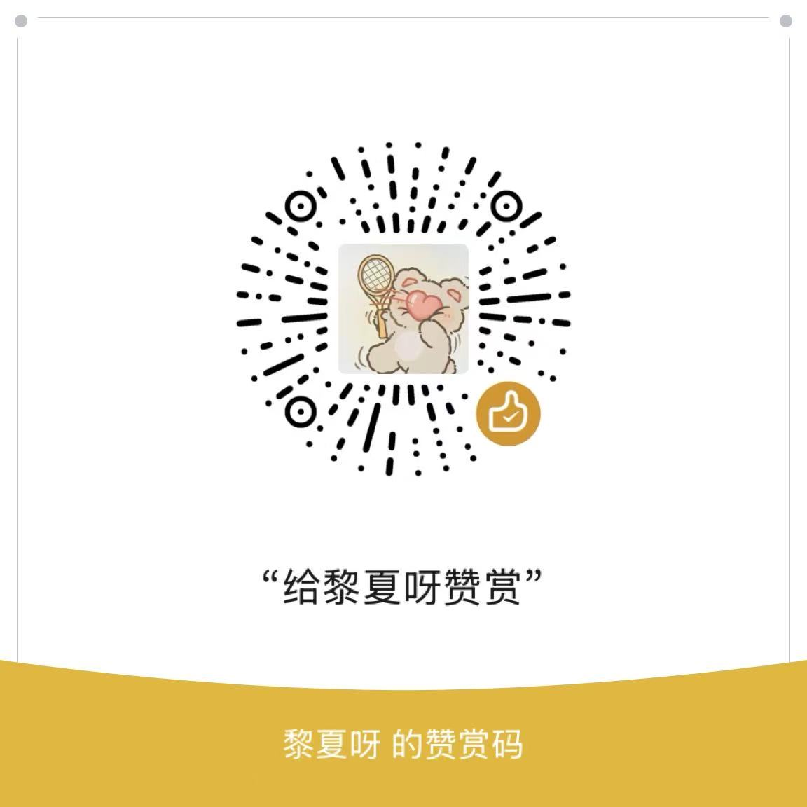

# WeChat MCP Server

<div align="center">


**一个符合 Model Context Protocol (MCP) 标准的微信消息发送服务器，专为AI助手设计**

[快速开始](#安装和配置) • [功能特点](#功能特点) • [使用方法](#使用方法) • [API文档](#可用工具) • [贡献指南](#贡献)

</div>

---

## 📋 目录

- [什么是 MCP？](#什么是-mcp)
- [功能特点](#功能特点)
- [项目结构](#项目结构)
- [安装和配置](#安装和配置)
- [可用工具](#可用工具)
- [使用方法](#使用方法)
- [MCP协议实现](#mcp协议实现)
- [技术架构](#技术架构)
- [注意事项](#注意事项)
- [故障排除](#故障排除)
- [开发和扩展](#开发和扩展)
- [支持我们](#支持我们)
- [免责声明](#️-重要免责声明)
- [许可证](#许可证)
- [贡献](#贡献)

---

## 🤖 什么是 MCP？

> **Model Context Protocol (MCP)** 是一个开放标准协议，用于连接AI助手与各种数据源和工具。它就像是AI应用的USB-C接口，提供了标准化的方式来连接AI模型与外部系统。

## ✨ 功能特点

- ✅ **MCP标准兼容** - 完全符合 MCP 标准规范
- ✅ **JSON-RPC 2.0** - 基于标准的 JSON-RPC 2.0 协议
- ✅ **微信消息发送** - 支持发送微信文本消息
- ✅ **定时发送** - 支持定时发送消息功能
- ✅ **异步处理** - 异步处理，不阻塞AI助手
- ✅ **完整日志** - 完整的错误处理和日志记录

## 📁 项目结构

```
WeChat-MCP-Server/
├── 📂 src/
│   ├── 📄 __init__.py
│   ├── 📄 mcp_server.py          # MCP服务器主要实现
│   └── 📄 wechat_controller.py   # 微信自动化控制器
├── 📂 examples/
│   └── 📄 mcp_client_example.py  # 客户端使用示例
├── 📂 docs/
│   └── 📄 QUICK_START.md         # 快速开始指南
├── 📂 支持我们/
│   ├── 🖼️ 1.jpg                  # 支付宝收款码
│   └── 🖼️ 2.jpg                  # 微信赞赏码
├── 📄 mcp_config.json           # MCP配置文件
├── 📄 requirements.txt          # 依赖包列表
├── 📄 LICENSE                   # 许可证文件
└── 📄 README.md                # 项目说明文档
```

## 🚀 安装和配置

### 1️⃣ 安装依赖

```bash
# 克隆项目
git clone https://github.com/linxiajin08/WeChat-MCP-Server.git
cd WeChat-MCP-Server

# 安装依赖
pip install -r requirements.txt
```

### 2️⃣ 确保微信已启动并登录

> ⚠️ **重要提醒**
> 
> 在使用前，请确保：
> - ✅ 微信客户端已安装并正在运行
> - ✅ 已成功登录微信账号
> - ✅ 微信窗口可见（不要最小化）

### 3️⃣ 配置AI助手

将此MCP服务器添加到您的AI助手配置中。以 **Claude Desktop** 为例：

```json
{
  "mcpServers": {
    "wechat": {
      "command": "python",
      "args": ["C:/path/to/WeChat-MCP-Server/src/mcp_server.py"],
      "env": {}
    }
  }
}
```

> **注意**: 请将 `C:/path/to/WeChat-MCP-Server` 替换为您实际的项目路径

## 🛠️ 可用工具

### 📤 send_wechat_message

发送文本消息到指定的微信联系人或群组。

**参数：**

| 参数名 | 类型 | 必填 | 描述 |
|--------|------|------|------|
| `contact_name` | `string` | ✅ | 联系人或群组名称 |
| `message` | `string` | ✅ | 要发送的文本消息 |

**示例：**
```json
{
  "name": "send_wechat_message",
  "arguments": {
    "contact_name": "文件传输助手",
    "message": "Hello from AI assistant!"
  }
}
```

### ⏰ schedule_wechat_message

安排在指定延迟后发送消息。

**参数：**

| 参数名 | 类型 | 必填 | 描述 |
|--------|------|------|------|
| `contact_name` | `string` | ✅ | 联系人或群组名称 |
| `message` | `string` | ✅ | 要发送的文本消息 |
| `delay_seconds` | `number` | ✅ | 延迟发送的秒数 |

**示例：**
```json
{
  "name": "schedule_wechat_message",
  "arguments": {
    "contact_name": "文件传输助手",
    "message": "This is a scheduled message!",
    "delay_seconds": 30
  }
}
```

## 💡 使用方法

### 🤖 在AI助手中使用

配置完成后，您可以直接在AI助手中使用自然语言请求：

> 💬 **示例对话**
> 
> - "帮我给张三发个微信消息说'会议推迟到下午3点'"
> - "10分钟后提醒我开会，发到工作群"
> - "给文件传输助手发送今天的工作总结"

### 🧪 直接测试

运行示例客户端进行测试：

```bash
cd examples
python mcp_client_example.py
```

## 🔧 MCP协议实现

本服务器实现了以下MCP标准方法：

| 方法 | 描述 |
|------|------|
| `initialize` | 初始化服务器连接 |
| `tools/list` | 列出可用工具 |
| `tools/call` | 调用指定工具 |

### 📡 JSON-RPC 消息格式

<details>
<summary>点击查看详细的消息格式示例</summary>

**请求示例：**
```json
{
  "jsonrpc": "2.0",
  "method": "tools/call",
  "params": {
    "name": "send_wechat_message",
    "arguments": {
      "contact_name": "文件传输助手",
      "message": "Hello World!"
    }
  },
  "id": 1
}
```

**响应示例：**
```json
{
  "jsonrpc": "2.0",
  "result": {
    "content": [
      {
        "type": "text",
        "text": "Successfully sent message to 文件传输助手: Hello World!"
      }
    ]
  },
  "id": 1
}
```

</details>

## 🏗️ 技术架构

### 🖥️ MCP服务器 (mcp_server.py)
- 实现JSON-RPC 2.0协议
- 处理MCP标准方法调用
- 管理工具注册和执行
- 提供完整的错误处理

### 📱 微信控制器 (wechat_controller.py)
- 使用pyautogui进行界面自动化
- 使用win32gui查找和控制微信窗口
- 支持异步消息发送和调度
- 提供状态检查功能

## ⚠️ 注意事项

### 🖥️ 系统要求
- **操作系统**: Windows 系统
- **微信版本**: 微信客户端（版本4.0以下）
- **Python版本**: Python 3.8+

### 🔐 权限要求
- 需要屏幕控制权限（pyautogui）

### 📝 使用限制
> ⚠️ **重要提醒**
> 
> - 使用期间请勿手动操作微信窗口
> - 确保微信窗口可见且未被遮挡
> - 建议先向"文件传输助手"测试

### 🛡️ 安全考虑
- 本工具仅用于自动化个人微信操作
- 请遵守微信使用条款
- 不建议用于大量消息发送

## 🔍 故障排除

<details>
<summary>📋 常见问题解决方案</summary>

### ❌ 找不到微信窗口
- ✅ 确保微信已启动并登录
- ✅ 检查微信窗口是否可见
- ✅ 尝试重启微信

### ❌ 消息发送失败
- ✅ 检查联系人名称是否正确
- ✅ 确保联系人在最近聊天列表中
- ✅ 验证微信窗口是否处于活动状态

### ❌ MCP连接问题
- ✅ 检查Python环境和依赖包
- ✅ 验证MCP配置文件路径
- ✅ 查看服务器日志输出

</details>

### 📊 日志调试

服务器会输出详细的日志信息，包括：
- ✅ 请求处理状态
- ✅ 微信操作结果
- ✅ 错误信息和堆栈跟踪

## 🚧 开发和扩展

### ➕ 添加新工具

1. 在 `mcp_server.py` 中的 `_register_tools()` 方法添加工具定义
2. 实现对应的执行方法
3. 在 `wechat_controller.py` 中添加具体功能
4. 更新配置文件和文档

### 🌐 支持其他平台

当前版本仅支持Windows系统。要支持其他平台，需要：
- 替换win32gui相关代码
- 适配不同系统的窗口管理
- 调整键盘快捷键映射

### 🗺️ 后续开发计划

- [ ] 支持macOS和Linux系统
- [ ] 增加更多微信操作功能
- [ ] 优化性能和稳定性
- [ ] 支持NT框架，即支持微信4.0版本以上

## 💖 支持我们

如果您觉得这个项目对您有帮助，请考虑：

- ⭐ 给项目点个Star
- 🔄 分享给您的朋友
- 💰 考虑捐赠以支持项目维护和发展

### 💳 捐赠方式

如果您愿意支持项目的持续发展，可以通过以下方式进行捐赠：

<div align="center">

**支付宝收款码**


**微信赞赏码**



</div>

您的每一份支持都是我们持续改进和维护项目的动力！❤️

---

## ⚠️ 重要免责声明

> **🚨 严重警告**
> 
> 本项目涉及微信自动化操作，存在重大风险。使用前请充分评估风险并自行承担所有后果。

<details>
<summary>📋 点击查看完整免责声明</summary>

### 🏷️ 项目性质声明
1. **纯技术研究**: 本项目仅为技术研究和学习目的而创建，用于演示MCP协议的实现
2. **非官方工具**: 本项目与腾讯公司、微信官方无任何关联，未经微信官方授权或认可
3. **实验性质**: 本项目为实验性代码，不保证稳定性、安全性或可靠性

### ⚠️ 使用风险警告
1. **账号风险**: 使用任何微信自动化工具都可能导致账号被限制、封禁或永久注销
2. **数据风险**: 可能导致聊天记录丢失、联系人信息泄露或其他数据安全问题
3. **系统风险**: 可能对您的计算机系统造成不稳定或安全漏洞
4. **法律风险**: 在某些地区或情况下，使用此类工具可能违反相关法律法规
5. **隐私风险**: 可能涉及个人隐私信息的处理和传输

### 📱 微信相关免责
1. **违反服务条款**: 使用本项目可能违反微信用户服务协议和使用条款
2. **功能失效**: 微信更新可能随时导致本项目功能完全失效
3. **官方制裁**: 腾讯公司有权对使用自动化工具的账号采取任何措施
4. **无官方支持**: 微信官方不会为使用本项目产生的任何问题提供技术支持

### 🔴 完全免责条款

**开发者、贡献者、分发者在任何情况下均不承担任何责任，包括但不限于：**

#### 直接责任免除
- 微信账号被封禁、限制或注销
- 个人数据丢失、泄露或被滥用
- 计算机系统损坏或数据损坏
- 消息发送错误或失败
- 隐私信息泄露
- 经济损失或商业损失

#### 间接责任免除
- 因使用本项目导致的任何第三方损失
- 因项目缺陷导致的连带损失
- 因违反法律法规产生的法律后果
- 因违反平台规则产生的处罚
- 任何形式的精神损失或名誉损失

#### 法律责任免除
- 违反当地法律法规的责任
- 违反微信服务条款的责任
- 侵犯他人权益的责任
- 数据保护法规违规的责任
- 任何民事、刑事或行政责任

### 📋 使用条件
**使用本项目即表示您：**
1. 已完全理解并接受上述所有风险和免责条款
2. 同意自行承担使用本项目的所有风险和后果
3. 承诺不会因使用本项目产生的任何问题追究开发者责任
4. 理解开发者有权随时停止项目维护而无需承担任何责任
5. 同意在发生任何争议时，开发者均不承担任何责任

### ⛔ 禁止使用声明
**以下情况严禁使用本项目：**
- 批量发送广告或垃圾信息
- 骚扰他人或恶意使用
- 违反当地法律法规的用途
- 侵犯他人权益的行为
- 违反微信服务条款的行为

### 💼 商业使用警告
**虽然MIT许可证允许商业使用，但我们强烈建议：**
- 商业使用前请充分评估法律风险
- 确保遵守所在地区的相关法律法规
- 遵守微信平台的商业使用政策
- 建议咨询法律专业人士的意见
- 商业使用产生的所有风险由使用者自行承担

**如果您不同意上述任何条款，请立即停止下载、安装或使用本项目。继续使用即视为完全同意并接受所有免责条款。**

</details>

---

## 📄 许可证

本项目采用 **MIT License** 开源许可证。

<details>
<summary>📋 许可证详情</summary>

MIT许可证允许：
- ✅ **商业使用** (⚠️ 需评估风险)
- ✅ 修改代码
- ✅ 分发代码
- ✅ 私人使用

但需要：
- 📋 保留版权声明
- 📋 保留许可证声明

**重要提醒**: 
- ✅ MIT许可证在法律上允许商业使用
- ⚠️ 但商业使用微信自动化工具存在较高风险
- 🔍 建议商业使用前咨询法律专业人士
- 📋 所有商业使用风险由使用者自行承担

</details>

## 🤝 贡献

我们欢迎所有形式的贡献！

### 🐛 报告问题
- 使用 [Issues](https://github.com/linxiajin08/WeChat-MCP-Server/issues) 报告bug
- 提供详细的错误信息和复现步骤

### 💡 功能建议
- 在 [Issues](https://github.com/linxiajin08/WeChat-MCP-Server/issues) 中提出新功能建议
- 详细描述功能需求和使用场景

### 🔧 代码贡献
1. Fork 本项目
2. 创建功能分支 (`git checkout -b feature/AmazingFeature`)
3. 提交更改 (`git commit -m 'Add some AmazingFeature'`)
4. 推送到分支 (`git push origin feature/AmazingFeature`)
5. 创建 Pull Request

---

## 📈 项目统计

### ⭐ Star 增长趋势

<div align="center">

[](https://star-history.com/#linxiajin08/WeChat-MCP-Server&Date)

</div>

### 📊 项目数据

<div align="center">


</div>

---

<div align="center">

**感谢您使用 WeChat MCP Server！**

如果这个项目对您有帮助，请考虑给我们一个 ⭐

[回到顶部](#wechat-mcp-server)

</div>